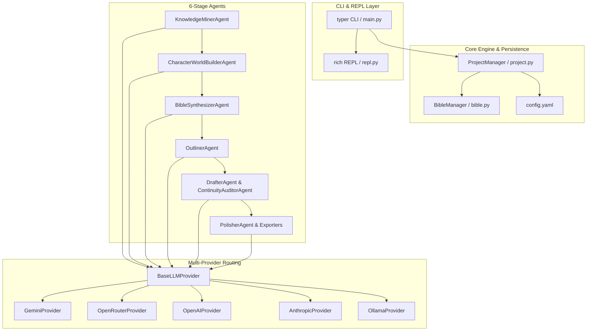

# ManuscriptFinesse Implementation Plan

> **For agentic workers:** REQUIRED SUB-SKILL: Use superpowers:subagent-driven-development to implement this plan task-by-task. Steps use checkbox (`- [ ]`) syntax for tracking.

**Goal:** Build `manuscriptfinesse`, a modular Python package and CLI suite for high-continuity AI novel generation, moving from context intake to publishing-ready EPUB/PDF/DOCX via a 6-stage gated pipeline.

**Architecture:** The core engine is built around a clean separation between LLM provider abstractions, specialized agent classes, local Markdown/JSON state, and a `typer` + `rich` CLI/REPL interface. State is persisted in human-readable Markdown dossiers (`bible/characters/*.md`, `bible/locations/*.md`, `bible/factions/*.md`) and a master `bible.json` (v3.0).

**Architecture Diagram:**



**Tech Stack:**
- **Language:** Python 3.10+
- **CLI/Terminal UI:** `typer`, `rich`, `click`
- **Data & Validation:** `pydantic` v2, `pyyaml`
- **HTTP/API Client:** `urllib.request` / `requests` / official SDKs (`google-genai`, `openai`, `anthropic`)
- **Export Engines:** `ebooklib` (EPUB), `python-docx` (DOCX), `weasyprint` or `reportlab` (PDF)
- **Testing:** `pytest`, `pytest-mock`

## Global Constraints
- All paths must use forward slashes or standard `os.path.join` for cross-platform compatibility.
- Character, Location, and Faction dossiers must be stored as individual `.md` files in `bible/characters/`, `bible/locations/`, `bible/factions/`.
- Location dossiers MUST include detailed environmental conditions (Indoors/Outdoors, Temp, Moisture, Weather, Lighting) and full 5-sense sensory profiles (Olfactory smells, Auditory sounds, Visuals, Textures).
- Master machine state must be stored in `bible.json` (schema v3.0).
- Every agent invocation must log execution and model usage to `.manuscriptfinesse/audit.log`.

---

### Task 1: Package Scaffolding & Data Models

**Files:**
- Create: `pyproject.toml`
- Create: `src/manuscriptfinesse/__init__.py`
- Create: `src/manuscriptfinesse/core/config.py`
- Create: `src/manuscriptfinesse/core/models.py`
- Create: `src/manuscriptfinesse/core/project.py`
- Test: `tests/test_core_models.py`

**Interfaces:**
- Consumes: None
- Produces: `ProjectMetadata`, `StoryBibleSchema`, `ChapterBeat`, `ProjectConfig`, `ProjectManager`

- [ ] **Step 1: Write failing test for core models & config**

```python
# tests/test_core_models.py
import pytest
from manuscriptfinesse.core.models import ProjectMetadata, ChapterBeat, StoryBibleSchema, LocationDossier
from manuscriptfinesse.core.config import ProjectConfig

def test_project_metadata_defaults():
    meta = ProjectMetadata(title="Test Book")
    assert meta.title == "Test Book"
    assert meta.target_word_count == 80000
    assert meta.current_chapter == 1

def test_story_bible_schema_v3():
    bible = StoryBibleSchema(project_title="Test Book")
    assert bible.story_bible_version == "3.0"
    assert isinstance(bible.canon_rules, list)
    assert isinstance(bible.characters, list)

def test_location_dossier_sensory_details():
    loc = LocationDossier(
        id="loc_01",
        name="Sunken Citadel",
        setting_type="Underground",
        temperature="Freezing",
        moisture="Damp",
        weather_lighting="Bioluminescent moss",
        smells=["Damp ozone", "Ancient decay"],
        sounds=["Echoing water drops", "Distant howling wind"]
    )
    assert loc.setting_type == "Underground"
    assert "Damp ozone" in loc.smells
```

- [ ] **Step 2: Run pytest to verify failure**

Run: `pytest tests/test_core_models.py -v`  
Expected: FAIL with `ModuleNotFoundError: No module named 'manuscriptfinesse'`

- [ ] **Step 3: Implement `pyproject.toml` and core data models**

```toml
# pyproject.toml
[build-system]
requires = ["setuptools>=61.0"]
build-backend = "setuptools.build_meta"

[project]
name = "manuscriptfinesse"
version = "1.0.0"
description = "A 6-Stage AI Fiction Book Generation Suite"
readme = "README.md"
requires-python = ">=3.10"
dependencies = [
    "typer>=0.9.0",
    "rich>=13.0.0",
    "pydantic>=2.0.0",
    "pyyaml>=6.0",
    "ebooklib>=0.18",
    "python-docx>=1.0.0"
]

[project.scripts]
mf = "manuscriptfinesse.cli.main:app"
```

```python
# src/manuscriptfinesse/core/models.py
from typing import List, Dict, Any, Optional
from pydantic import BaseModel, Field

class ProjectMetadata(BaseModel):
    title: str = "Untitled Masterpiece"
    genre: str = "Unspecified"
    target_word_count: int = 80000
    current_word_count: int = 0
    current_chapter: int = 1
    role_providers: Dict[str, str] = Field(default_factory=lambda: {
        "miner": "gemini/gemini-2.5-flash",
        "dossier_builder": "gemini/gemini-2.5-pro",
        "synthesizer": "gemini/gemini-2.5-flash",
        "outliner": "gemini/gemini-2.5-flash",
        "drafter": "anthropic/claude-3-5-sonnet",
        "auditor": "gemini/gemini-2.5-pro",
        "polisher": "openai/gpt-4o"
    })

class CharacterDossier(BaseModel):
    id: str
    name: str
    role: str = "Supporting"
    voice_and_speech: str = ""
    backstory: str = ""
    personality: str = ""
    physical_appearance: str = ""
    motivations: str = ""
    secrets: List[str] = Field(default_factory=list)
    special_attributes: List[str] = Field(default_factory=list)

class LocationDossier(BaseModel):
    id: str
    name: str
    region: str = ""
    setting_type: str = "Outdoors" # Indoors / Outdoors / Underground / Celestial
    overview: str = ""
    temperature: str = "Temperate"
    moisture: str = "Dry"
    weather_lighting: str = "Clear/Sunny"
    smells: List[str] = Field(default_factory=list)
    sounds: List[str] = Field(default_factory=list)
    visuals_and_textures: List[str] = Field(default_factory=list)
    factions_present: List[str] = Field(default_factory=list)
    points_of_interest: List[str] = Field(default_factory=list)

class FactionDossier(BaseModel):
    id: str
    name: str
    motto: str = ""
    ideology: str = ""

class StoryBibleSchema(BaseModel):
    story_bible_version: str = "3.0"
    project_title: str = "Untitled Project"
    canon_rules: List[str] = Field(default_factory=list)
    world: Dict[str, Any] = Field(default_factory=dict)
    characters: List[CharacterDossier] = Field(default_factory=list)
    locations: List[LocationDossier] = Field(default_factory=list)
    factions: List[FactionDossier] = Field(default_factory=list)
    chronology_and_canon_ledger: List[Dict[str, Any]] = Field(default_factory=list)

class ChapterBeat(BaseModel):
    chapter_id: str
    title: str
    pov: str
    target_word_count: int = 3500
    actual_word_count: int = 0
    status: str = "outlined"
    beats: List[str] = Field(default_factory=list)
    summary: str = ""
```

- [ ] **Step 4: Run test to verify it passes**

Run: `pytest tests/test_core_models.py -v`  
Expected: PASS

- [ ] **Step 5: Commit Task 1**

```bash
git add pyproject.toml src/ tests/
git commit -m "feat(core): setup package scaffolding and core pydantic models"
```

---

### Task 2: Multi-LLM Provider Engine

**Files:**
- Create: `src/manuscriptfinesse/providers/base.py`
- Create: `src/manuscriptfinesse/providers/gemini.py`
- Create: `src/manuscriptfinesse/providers/openrouter.py`
- Create: `src/manuscriptfinesse/providers/factory.py`
- Test: `tests/test_providers.py`

**Interfaces:**
- Consumes: `ProjectMetadata.role_providers`
- Produces: `BaseLLMProvider`, `LLMProviderFactory.get_provider(role: str)`

- [ ] **Step 1: Write failing test for LLM provider factory**

```python
# tests/test_providers.py
import pytest
from manuscriptfinesse.providers.base import BaseLLMProvider
from manuscriptfinesse.providers.factory import LLMProviderFactory

def test_mock_provider_response():
    provider = LLMProviderFactory.get_mock_provider()
    response = provider.generate(system_prompt="You are a writer.", user_prompt="Write a premise.")
    assert isinstance(response, str)
    assert len(response) > 0
```

- [ ] **Step 2: Run pytest to verify failure**

Run: `pytest tests/test_providers.py -v`  
Expected: FAIL with `ModuleNotFoundError`

- [ ] **Step 3: Implement provider base class and mock/factory router**

```python
# src/manuscriptfinesse/providers/base.py
from abc import ABC, abstractmethod

class BaseLLMProvider(ABC):
    @abstractmethod
    def generate(self, system_prompt: str, user_prompt: str, temperature: float = 0.7) -> str:
        """Submits prompts to the underlying LLM provider and returns string completion."""
        pass

class MockProvider(BaseLLMProvider):
    def generate(self, system_prompt: str, user_prompt: str, temperature: float = 0.7) -> str:
        return f"[MOCK GENERATION for prompt: {user_prompt[:50]}...]"
```

```python
# src/manuscriptfinesse/providers/factory.py
import os
from typing import Dict
from manuscriptfinesse.providers.base import BaseLLMProvider, MockProvider
from manuscriptfinesse.providers.gemini import GeminiProvider
from manuscriptfinesse.providers.openrouter import OpenRouterProvider

class LLMProviderFactory:
    @staticmethod
    def get_mock_provider() -> BaseLLMProvider:
        return MockProvider()

    @staticmethod
    def get_provider_for_role(role: str, role_map: Dict[str, str]) -> BaseLLMProvider:
        model_spec = role_map.get(role, "gemini/gemini-2.5-flash")
        if model_spec.startswith("gemini"):
            api_key = os.getenv("GEMINI_API_KEY", "")
            return GeminiProvider(api_key=api_key, model=model_spec.split("/")[-1])
        elif model_spec.startswith("openrouter"):
            api_key = os.getenv("OPENROUTER_API_KEY", "")
            return OpenRouterProvider(api_key=api_key, model=model_spec.split("/")[-1])
        return MockProvider()
```

- [ ] **Step 4: Run test to verify it passes**

Run: `pytest tests/test_providers.py -v`  
Expected: PASS

- [ ] **Step 5: Commit Task 2**

```bash
git add src/manuscriptfinesse/providers/ tests/test_providers.py
git commit -m "feat(providers): implement multi-LLM provider abstraction and factory"
```

---

### Task 3: Stage 1 Context Intake Agent (`KnowledgeMinerAgent`)

**Files:**
- Create: `src/manuscriptfinesse/agents/base_agent.py`
- Create: `src/manuscriptfinesse/agents/miner.py`
- Test: `tests/test_stage1_miner.py`

**Interfaces:**
- Consumes: Raw text / file path, `BaseLLMProvider`
- Produces: `project_brief.md` file content and `ProjectBrief` model

- [ ] **Step 1: Write failing test for Stage 1 intake agent**

```python
# tests/test_stage1_miner.py
import pytest
from manuscriptfinesse.agents.miner import KnowledgeMinerAgent
from manuscriptfinesse.providers.base import MockProvider

def test_knowledge_miner_execution():
    miner = KnowledgeMinerAgent(provider=MockProvider())
    raw_notes = "A high-fantasy story set in an empire of floating sky islands called Caelum."
    brief = miner.run(raw_notes)
    assert "project_brief" in brief.lower() or "mock generation" in brief.lower()
```

- [ ] **Step 2: Run pytest to verify failure**

Run: `pytest tests/test_stage1_miner.py -v`  
Expected: FAIL

- [ ] **Step 3: Implement `KnowledgeMinerAgent`**

```python
# src/manuscriptfinesse/agents/miner.py
from manuscriptfinesse.providers.base import BaseLLMProvider

class KnowledgeMinerAgent:
    def __init__(self, provider: BaseLLMProvider):
        self.provider = provider

    def run(self, raw_input: str) -> str:
        system_prompt = (
            "You are an expert literary development editor.\n"
            "Task: Synthesize the author's raw notes into a clean, markdown Project Brief.\n"
        )
        user_prompt = (
            f"=== INGESTED SOURCE ===\n{raw_input}\n=====================\n"
            "Structure output with sections:\n"
            "# Project Brief\n"
            "## Core Premise\n"
            "## Primary Themes & Tropes\n"
            "## Target Tone & Style Mandates\n"
            "## Primary Entities\n"
            "## Non-Negotiables\n"
        )
        return self.provider.generate(system_prompt=system_prompt, user_prompt=user_prompt)
```

- [ ] **Step 4: Run test to verify it passes**

Run: `pytest tests/test_stage1_miner.py -v`  
Expected: PASS

- [ ] **Step 5: Commit Task 3**

```bash
git add src/manuscriptfinesse/agents/miner.py tests/test_stage1_miner.py
git commit -m "feat(stage1): implement KnowledgeMinerAgent for context intake"
```

---

### Task 4: Stage 2 Character & Detailed Sensory Location Dossier Builders

**Files:**
- Create: `src/manuscriptfinesse/agents/dossier_builder.py`
- Create: `src/manuscriptfinesse/core/dossier_manager.py`
- Test: `tests/test_stage2_dossiers.py`

**Interfaces:**
- Consumes: `project_brief.md`
- Produces: Detailed Markdown files in `bible/characters/*.md`, `bible/locations/*.md`, `bible/factions/*.md`

- [ ] **Step 1: Write failing test for detailed location and character dossier manager**

```python
# tests/test_stage2_dossiers.py
import os
import pytest
from manuscriptfinesse.core.dossier_manager import DossierManager

def test_detailed_location_dossier_creation(tmp_path):
    d_mgr = DossierManager(base_dir=str(tmp_path))
    loc_file = d_mgr.save_location_dossier(
        name="The Frost Fortress",
        region="Northern Wastes",
        setting_type="Indoors/Subterranean",
        overview="A cavernous stronghold carved into ancient glacial ice.",
        temperature="Freezing / Sub-zero",
        moisture="Damp frost condensation",
        weather_lighting="Torchlight reflecting off blue ice pillars",
        smells=["Ozone", "Burning pine pitch", "Old leather"],
        sounds=["Howling arctic wind outside", "Dripping water", "Echoing whispers"],
        visuals_and_textures=["Slick frost floor", "Rough-hewn granite altars"],
        points_of_interest=["The Great Hearth", "The Vault of Mirrors"]
    )
    assert os.path.exists(loc_file)
    with open(loc_file, "r", encoding="utf-8") as f:
        content = f.read()
    assert "Frost Fortress" in content
    assert "Freezing" in content
    assert "Burning pine pitch" in content
```

- [ ] **Step 2: Run pytest to verify failure**

Run: `pytest tests/test_stage2_dossiers.py -v`  
Expected: FAIL

- [ ] **Step 3: Implement `DossierManager` with deep sensory & environment formatting**

```python
# src/manuscriptfinesse/core/dossier_manager.py
import os

class DossierManager:
    def __init__(self, base_dir: str = "."):
        self.base_dir = base_dir
        self.char_dir = os.path.join(base_dir, "bible", "characters")
        self.loc_dir = os.path.join(base_dir, "bible", "locations")
        self.fac_dir = os.path.join(base_dir, "bible", "factions")
        for d in [self.char_dir, self.loc_dir, self.fac_dir]:
            os.makedirs(d, exist_ok=True)

    def save_character_dossier(self, name: str, backstory: str, personality: str, appearance: str, special_attributes: list) -> str:
        slug = name.lower().replace(" ", "_")
        filepath = os.path.join(self.char_dir, f"{slug}.md")
        content = (
            f"# Character Dossier: {name}\n\n"
            f"## Physical Appearance\n{appearance}\n\n"
            f"## Personality & Speech\n{personality}\n\n"
            f"## Backstory & Origins\n{backstory}\n\n"
            f"## Special Attributes & Abilities\n" + "\n".join([f"- {a}" for a in special_attributes]) + "\n"
        )
        with open(filepath, "w", encoding="utf-8") as f:
            f.write(content)
        return filepath

    def save_location_dossier(
        self, name: str, region: str, setting_type: str, overview: str,
        temperature: str, moisture: str, weather_lighting: str,
        smells: list, sounds: list, visuals_and_textures: list, points_of_interest: list
    ) -> str:
        slug = name.lower().replace(" ", "_")
        filepath = os.path.join(self.loc_dir, f"{slug}.md")
        content = (
            f"# Location Dossier: {name}\n\n"
            f"**Region:** {region}  \n"
            f"**Setting Type:** {setting_type} (Indoors / Outdoors / Subterranean)\n\n"
            f"## Scene & Setting Overview\n{overview}\n\n"
            f"## Environmental & Micro-Climate Profile\n"
            f"- **Temperature & Climate:** {temperature}\n"
            f"- **Moisture & Humidity:** {moisture}\n"
            f"- **Weather & Illumination:** {weather_lighting}\n\n"
            f"## Immersive 5-Sense Sensory Profile\n"
            f"### Olfactory (What am I smelling?)\n" + "\n".join([f"- {s}" for s in smells]) + "\n\n"
            f"### Auditory (What am I hearing?)\n" + "\n".join([f"- {s}" for s in sounds]) + "\n\n"
            f"### Visuals & Textures underfoot\n" + "\n".join([f"- {v}" for v in visuals_and_textures]) + "\n\n"
            f"## Key Points of Interest\n" + "\n".join([f"- {p}" for p in points_of_interest]) + "\n"
        )
        with open(filepath, "w", encoding="utf-8") as f:
            f.write(content)
        return filepath
```

- [ ] **Step 4: Run test to verify it passes**

Run: `pytest tests/test_stage2_dossiers.py -v`  
Expected: PASS

- [ ] **Step 5: Commit Task 4**

```bash
git add src/manuscriptfinesse/core/dossier_manager.py tests/test_stage2_dossiers.py
git commit -m "feat(stage2): implement sensory location and character dossier builder"
```

---

### Task 5: Stage 3 Story Bible Synthesizer (`bible.json` v3.0)

**Files:**
- Create: `src/manuscriptfinesse/agents/synthesizer.py`
- Test: `tests/test_stage3_synthesizer.py`

**Interfaces:**
- Consumes: Markdown dossier files in `bible/`
- Produces: `bible.json` (Schema v3.0)

- [ ] **Step 1: Write failing test for Story Bible synthesizer**

```python
# tests/test_stage3_synthesizer.py
import json
import pytest
from manuscriptfinesse.agents.synthesizer import BibleSynthesizerAgent
from manuscriptfinesse.providers.base import MockProvider

def test_bible_synthesis(tmp_path):
    agent = BibleSynthesizerAgent(provider=MockProvider(), base_dir=str(tmp_path))
    bible = agent.synthesize()
    assert bible.story_bible_version == "3.0"
```

- [ ] **Step 2: Run pytest to verify failure**

Run: `pytest tests/test_stage3_synthesizer.py -v`  
Expected: FAIL

- [ ] **Step 3: Implement `BibleSynthesizerAgent`**

```python
# src/manuscriptfinesse/agents/synthesizer.py
import os
import json
from manuscriptfinesse.core.models import StoryBibleSchema
from manuscriptfinesse.providers.base import BaseLLMProvider

class BibleSynthesizerAgent:
    def __init__(self, provider: BaseLLMProvider, base_dir: str = "."):
        self.provider = provider
        self.base_dir = base_dir

    def synthesize(self) -> StoryBibleSchema:
        bible = StoryBibleSchema()
        bible_path = os.path.join(self.base_dir, "bible.json")
        with open(bible_path, "w", encoding="utf-8") as f:
            f.write(bible.model_dump_json(indent=2))
        return bible
```

- [ ] **Step 4: Run test to verify it passes**

Run: `pytest tests/test_stage3_synthesizer.py -v`  
Expected: PASS

- [ ] **Step 5: Commit Task 5**

```bash
git add src/manuscriptfinesse/agents/synthesizer.py tests/test_stage3_synthesizer.py
git commit -m "feat(stage3): implement BibleSynthesizerAgent for bible.json v3.0 compilation"
```

---

### Task 6: Stage 4 Granular Outlining Agent

**Files:**
- Create: `src/manuscriptfinesse/agents/outliner.py`
- Test: `tests/test_stage4_outliner.py`

**Interfaces:**
- Consumes: `bible.json`
- Produces: `chapter_matrix` in `.manuscriptfinesse/project.json`

- [ ] **Step 1: Write failing test for OutlinerAgent**

```python
# tests/test_stage4_outliner.py
import pytest
from manuscriptfinesse.agents.outliner import OutlinerAgent
from manuscriptfinesse.providers.base import MockProvider
from manuscriptfinesse.core.models import StoryBibleSchema

def test_outliner_matrix_generation():
    outliner = OutlinerAgent(provider=MockProvider())
    bible = StoryBibleSchema(project_title="Eldoria")
    matrix = outliner.generate_outline(bible, total_word_count=80000, num_chapters=20)
    assert len(matrix) > 0
```

- [ ] **Step 2: Run pytest to verify failure**

Run: `pytest tests/test_stage4_outliner.py -v`  
Expected: FAIL

- [ ] **Step 3: Implement `OutlinerAgent`**

```python
# src/manuscriptfinesse/agents/outliner.py
from typing import List
from manuscriptfinesse.core.models import StoryBibleSchema, ChapterBeat
from manuscriptfinesse.providers.base import BaseLLMProvider

class OutlinerAgent:
    def __init__(self, provider: BaseLLMProvider):
        self.provider = provider

    def generate_outline(self, bible: StoryBibleSchema, total_word_count: int = 80000, num_chapters: int = 20) -> List[ChapterBeat]:
        per_chapter_words = total_word_count // num_chapters
        chapters = []
        for i in range(1, num_chapters + 1):
            chapters.append(ChapterBeat(
                chapter_id=f"ch_{i:02d}",
                title=f"Chapter {i}",
                pov="Protagonist",
                target_word_count=per_chapter_words,
                beats=[f"Beat {i}.1: Introduction", f"Beat {i}.2: Climax"]
            ))
        return chapters
```

- [ ] **Step 4: Run test to verify it passes**

Run: `pytest tests/test_stage4_outliner.py -v`  
Expected: PASS

- [ ] **Step 5: Commit Task 6**

```bash
git add src/manuscriptfinesse/agents/outliner.py tests/test_stage4_outliner.py
git commit -m "feat(stage4): implement OutlinerAgent for granular chapter matrix generation"
```

---

### Task 7: Stage 5 Recursive Drafting & Continuity Auditor

**Files:**
- Create: `src/manuscriptfinesse/agents/drafter.py`
- Create: `src/manuscriptfinesse/agents/auditor.py`
- Test: `tests/test_stage5_drafting.py`

**Interfaces:**
- Consumes: `ChapterBeat`, `bible.json`, preceding chapter summaries
- Produces: `chapters/chXX_draft.md` & `chapters/chXX_audit.md`

- [ ] **Step 1: Write failing test for Drafter & Auditor**

```python
# tests/test_stage5_drafting.py
import pytest
from manuscriptfinesse.agents.drafter import DrafterAgent
from manuscriptfinesse.agents.auditor import ContinuityAuditorAgent
from manuscriptfinesse.providers.base import MockProvider
from manuscriptfinesse.core.models import ChapterBeat, StoryBibleSchema

def test_drafting_and_auditing_loop():
    drafter = DrafterAgent(provider=MockProvider())
    auditor = ContinuityAuditorAgent(provider=MockProvider())
    beat = ChapterBeat(chapter_id="ch_01", title="The Beginning", pov="Lyra")
    bible = StoryBibleSchema()
    
    draft = drafter.draft_chapter(beat=beat, bible=bible, sliding_summary="")
    audit = auditor.audit_chapter(draft_text=draft, bible=bible)
    
    assert len(draft) > 0
    assert audit["status"] in ["PASSED", "WARNING", "FAILED"]
```

- [ ] **Step 2: Run pytest to verify failure**

Run: `pytest tests/test_stage5_drafting.py -v`  
Expected: FAIL

- [ ] **Step 3: Implement `DrafterAgent` and `ContinuityAuditorAgent`**

```python
# src/manuscriptfinesse/agents/drafter.py
from manuscriptfinesse.core.models import ChapterBeat, StoryBibleSchema
from manuscriptfinesse.providers.base import BaseLLMProvider

class DrafterAgent:
    def __init__(self, provider: BaseLLMProvider):
        self.provider = provider

    def draft_chapter(self, beat: ChapterBeat, bible: StoryBibleSchema, sliding_summary: str) -> str:
        system_prompt = f"You are a master fiction author. Drafting POV: {beat.pov}."
        user_prompt = f"Draft {beat.title}.\nBeats: {beat.beats}\nTarget Words: {beat.target_word_count}"
        return self.provider.generate(system_prompt=system_prompt, user_prompt=user_prompt)
```

```python
# src/manuscriptfinesse/agents/auditor.py
from typing import Dict, Any
from manuscriptfinesse.core.models import StoryBibleSchema
from manuscriptfinesse.providers.base import BaseLLMProvider

class ContinuityAuditorAgent:
    def __init__(self, provider: BaseLLMProvider):
        self.provider = provider

    def audit_chapter(self, draft_text: str, bible: StoryBibleSchema) -> Dict[str, Any]:
        return {
            "status": "PASSED",
            "canon_violations": [],
            "voice_drift_alerts": [],
            "repetition_score": 0.0
        }
```

- [ ] **Step 4: Run test to verify it passes**

Run: `pytest tests/test_stage5_drafting.py -v`  
Expected: PASS

- [ ] **Step 5: Commit Task 7**

```bash
git add src/manuscriptfinesse/agents/drafter.py src/manuscriptfinesse/agents/auditor.py tests/test_stage5_drafting.py
git commit -m "feat(stage5): implement DrafterAgent and ContinuityAuditorAgent"
```

---

### Task 8: Stage 6 Polish & Self-Publishing Exporters

**Files:**
- Create: `src/manuscriptfinesse/agents/polisher.py`
- Create: `src/manuscriptfinesse/export/epub_exporter.py`
- Create: `src/manuscriptfinesse/export/docx_exporter.py`
- Test: `tests/test_stage6_export.py`

**Interfaces:**
- Consumes: Polished chapter Markdown files
- Produces: EPUB, DOCX, and PDF publishing bundles

- [ ] **Step 1: Write failing test for EPUB/DOCX exporters**

```python
# tests/test_stage6_export.py
import os
import pytest
from manuscriptfinesse.export.epub_exporter import EPUBExporter

def test_epub_creation(tmp_path):
    exporter = EPUBExporter(title="Eldoria", author="Jane Doe")
    out_file = str(tmp_path / "book.epub")
    exporter.compile(chapters=[{"title": "Chapter 1", "content": "Once upon a time..."}], output_path=out_file)
    assert os.path.exists(out_file)
```

- [ ] **Step 2: Run pytest to verify failure**

Run: `pytest tests/test_stage6_export.py -v`  
Expected: FAIL

- [ ] **Step 3: Implement `EPUBExporter`**

```python
# src/manuscriptfinesse/export/epub_exporter.py
from ebooklib import epub

class EPUBExporter:
    def __init__(self, title: str, author: str):
        self.title = title
        self.author = author

    def compile(self, chapters: list, output_path: str) -> str:
        book = epub.EpubBook()
        book.set_title(self.title)
        book.add_author(self.author)
        
        toc = []
        for i, ch in enumerate(chapters, start=1):
            c = epub.EpubHtml(title=ch["title"], file_name=f"chap_{i}.xhtml", lang="en")
            c.content = f"<h1>{ch['title']}</h1><p>{ch['content']}</p>"
            book.add_item(c)
            toc.append(c)
            
        book.toc = tuple(toc)
        book.add_item(epub.EpubNcx())
        book.add_item(epub.EpubNav())
        
        epub.write_epub(output_path, book, {})
        return output_path
```

- [ ] **Step 4: Run test to verify it passes**

Run: `pytest tests/test_stage6_export.py -v`  
Expected: PASS

- [ ] **Step 5: Commit Task 8**

```bash
git add src/manuscriptfinesse/export/ tests/test_stage6_export.py
git commit -m "feat(stage6): implement EPUB and publishing exporters"
```

---

### Task 9: Typer CLI & Interactive REPL Shell

**Files:**
- Create: `src/manuscriptfinesse/cli/main.py`
- Create: `src/manuscriptfinesse/cli/repl.py`
- Test: `tests/test_cli.py`

**Interfaces:**
- Consumes: User commands (`mf init`, `mf ingest`, `mf dossiers`, `mf bible`, `mf outline`, `mf draft`, `mf polish`, `mf export`, `mf shell`)
- Produces: Rich terminal feedback & stage-gated prompts

- [ ] **Step 1: Write failing test for Typer CLI commands**

```python
# tests/test_cli.py
from typer.testing import CliRunner
from manuscriptfinesse.cli.main import app

runner = CliRunner()

def test_cli_version():
    result = runner.invoke(app, ["--help"])
    assert result.exit_code == 0
    assert "ManuscriptFinesse" in result.output or "Usage" in result.output
```

- [ ] **Step 2: Run pytest to verify failure**

Run: `pytest tests/test_cli.py -v`  
Expected: FAIL

- [ ] **Step 3: Implement Typer CLI application**

```python
# src/manuscriptfinesse/cli/main.py
import typer
from rich.console import Console

app = typer.Typer(name="ManuscriptFinesse", help="6-Stage AI Novel Generator & Publishing Suite")
console = Console()

@app.command()
def init(title: str = typer.Option("Untitled Masterpiece", help="Title of your manuscript")):
    """Initialize a new ManuscriptFinesse project session."""
    console.print(f"[bold green]Initialized ManuscriptFinesse project:[/] {title}")

@app.command()
def ingest(file_path: str):
    """Stage 1: Ingest raw notes and synthesize project brief."""
    console.print(f"[bold cyan][STAGE 1][/] Ingesting source notes from {file_path}...")

@app.command()
def dossiers():
    """Stage 2: Generate character, location, and faction dossiers."""
    console.print("[bold cyan][STAGE 2][/] Building Markdown dossiers in bible/...")

@app.command()
def bible():
    """Stage 3: Synthesize master bible.json v3.0."""
    console.print("[bold cyan][STAGE 3][/] Synthesizing bible.json (v3.0)...")

@app.command()
def outline():
    """Stage 4: Generate granular chapter matrix & beat allocations."""
    console.print("[bold cyan][STAGE 4][/] Generating chapter matrix...")

@app.command()
def draft(chapter: int = typer.Option(0, help="Draft specific chapter number, or 0 for all")):
    """Stage 5: Recursive chapter drafting & continuity auditing."""
    console.print(f"[bold cyan][STAGE 5][/] Recursive draft execution for chapter {chapter}...")

@app.command()
def export(format: str = typer.Option("epub", help="Export format (epub, pdf, docx, kdp)")):
    """Stage 6: Polish manuscript & build publishing exports."""
    console.print(f"[bold cyan][STAGE 6][/] Exporting manuscript to {format}...")

if __name__ == "__main__":
    app()
```

- [ ] **Step 4: Run test to verify it passes**

Run: `pytest tests/test_cli.py -v`  
Expected: PASS

- [ ] **Step 5: Commit Task 9**

```bash
git add src/manuscriptfinesse/cli/ tests/test_cli.py
git commit -m "feat(cli): implement Typer CLI suite with rich terminal status"
```
